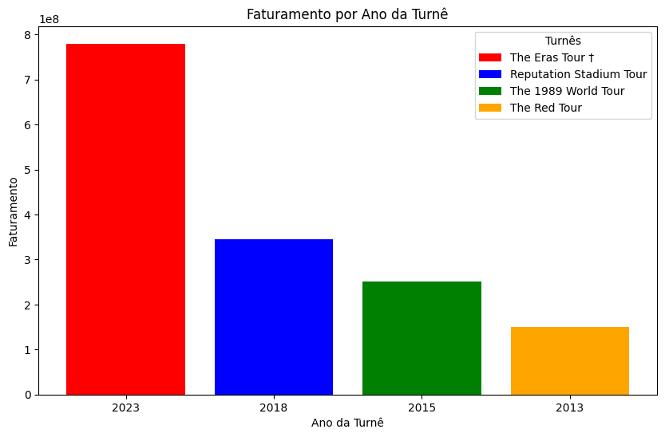
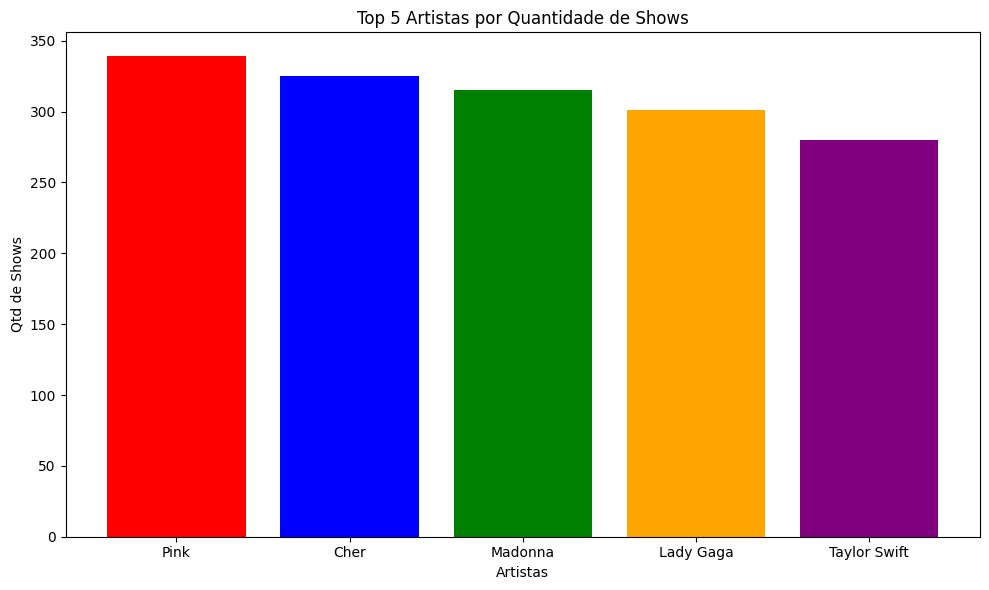

# Desafio da Sprint 1

## Enunciado

Faça o download do arquivo "concert_tours_by_women.csv" disponível nos recursos da secção para:

- **Etapa 1:**

Faça um script Python chamado "etl.py" que fará a limpeza dos dados do csv. O resultado deve ser um arquivo chamado "csv_limpo.csv"

- **Etapa 2:**

Crie um script Python chamado "job.py" que fará o processamento dos dados e responderá as seguintes questões:

    - Q1: Qual é a artista que mais aparece nessa lista e possui a maior média de seu faturamento bruto (Actual gross) ?

    - Q2: Das turnês que aconteceram em um ano, apresente a turnê com a maior média de faturamento bruto (Average gross).

    - Q3: Quais são as 3 artistas que possuem o show (unitário) mais lucrativo, dentro de uma turnê ?

    - Q4: Para a artista que mais aparece na lista e que tenha o maior somatório de faturamento bruto, crie um gráfico de linhas que mostre o faturamento por ano da turnê (use a coluna Start year)

    - Q5: Faça um gráfico de colunas demonstrando as 5 artistas com mais shows na lista.

- **Etapa 3:**

Crie um arquivo no formato Dockerfile que execute o script criado na etapa 1

- **Etapa 4:**

Crie um arquivo no formato Dockerfile que execute o script criado na etapa 2

- **Etapa 5:**

Criar um arquivo "docker-compose" para conectar os dois containers e rodar a aplicação completa utilizando um volume em um pasta local criada especificamente para isso, o nome do diretório deve ser "/volume". A execução do desafio deve ser mantido pelo "docker-compose".

## Códigos Fonte

- [Script ETL](./etl/etl.py)
- [Dockerfile do script ETL](./etl/dockerfile)
- [Script JOB](./job/job.py)
- [Dockerfile do script JOB](./job/dockerfile)
- [Arquivo docker-compose](./docker-compose.yaml)

## Etapa 1

Para a resolução da primeira etapa, foi necessário:

- Retirar as colunas 'Peak', 'All Time Peak', 'Ref.' dos dados
- Criar duas colunas: uma representando o ano inicial da turne, 'Start year', e uma representando o último ano da turne, 'End year', para que então seja possível retirar a coluna 'Year(s)'
- Por fim, fazer o tratamento dos valores numéricos para que ao longo da análise dos dados eles sejam tratados como valores inteiros ou flutuantes ao invés de strings

Após tudo isso, bastou expotar a coluna tratada e alterada como um arquivo csv sob o título "csv_limpo.csv" usando a função **to_csv("csv_limpo.csv", index=False)**

Segue a evidência da etapa: [Resultado do script](./volume/csv_limpo.csv)

## Etapa 2

Para a resolução da segunda etapa, foi necessário inicialmente abrir o arquivo "csv_limpo.csv" e criar o arquivo "respostas.txt" que será onde estará armazenado as respostas das perguntas que não envolvem a criação de um gráfico.

- **Q1: Qual é a artista que mais aparece nessa lista e possui a maior média de seu faturamento bruto (Actual gross) ?**

    Para responder essa pergunta bastou fazer a contagem frequência que cada artista aparecia na coluna "[Artists]" usando a função **.value_counts()** e então fazer o um cálculo para descobrir a artista com a maior média de seu faturamento bruto:

    ```python
    repeticoes = dados['Artist'].value_counts()
    maior_media = dados[['Artist', 'Actual gross']].groupby(['Artist']).mean().sort_values(['Actual gross'], ascending=False).iloc[0]
    ```

    O resultado do cálculo foi usado para filtrar a serie de dados gerada pela função **.value_counts()** e então conseguir os a artista com maior média, a quantiade de aparições dela na lista e sua média de faturamento bruto.

- **Q2: Das turnês que aconteceram em um ano, apresente a turnê com a maior média de faturamento bruto (Average gross)**

    Para responder essa pergunta bastou filtrar o lista pelas linhas que possuem o ano inicial da turne igual ao ano final usando **.loc[]** para então fazer a ordenação de forma descrente dos dados e pergar a primeira linha da lista ordenada:

    ```python
    turnes = dados.loc[dados['Start year'] == dados['End year']]
    turnes = turnes.sort_values(['Average gross'], ascending=False).iloc[0]
    ```

- **Q3: Quais são as 3 artistas que possuem o show (unitário) mais lucrativo, dentro de uma turnê ? Cite também o nome dessas turnês para cada artista.**

    Para responder essa pergunta, a lista foi filtrada pelas colunas 'Adjustedgross (in 2022 dollars)', 'Artist', 'Tour title' e 'Shows' para então criar uma nova coluna nessa lista lista filtrada representando o valor dos shows unitário calculado pela divisão da coluna 'Adjustedgross (in 2022 dollars)' pela coluna 'Shows'.
    Dessa forma, basta pegar as primeiras artistas da lista após ela ser ordenada de forma descrescente.

    ```python
    turnes = dados[['Adjustedgross (in 2022 dollars)', 'Artist', 'Tour title', 'Shows']].copy()
    turnes['Gross per show'] = turnes['Adjustedgross (in 2022 dollars)'] / turnes['Shows']
    turnes = turnes.sort_values(['Gross per show'], ascending=False).head(4)
    ```

- **Q4: Para a artista que mais aparece nessa lista e que tenha o maior somatório de faturamento bruto, crie um gráfico de linhas que mostre o faturamento por ano da turnê (use a coluna Start Year).**

    Para responder a pergunta, primeiro eu preciso calcular qual artista possui a maior somatória de faturamento bruto e eu faço isso usando da função **.groupby()** para grupar as linhas por artista somand os valores números. Dessa forma, basta pegar o maior valor e usar dele para filtrar os dados usando a função **.loc[]**para que eu tenha apenas as linhas da lista com a artista de maior somatória de faturamento.

    Então, para facilitar a plotagem dos dados, eu crio três variáveis cada um representando uma coluna de interesse para o gráfico e transformando-as em listas.

    ```python
    maior_soma = dados[['Artist', 'Actual gross']].groupby(['Artist']).sum().nlargest(1, "Actual gross")
    dados_filtrados = dados.loc[dados['Artist'] == maior_soma.index[0]].copy()

    anos = dados_filtrados['Start year'].astype(str).tolist()
    gross = dados_filtrados['Actual gross'].tolist()
    label = dados_filtrados['Tour title'].tolist()
    ```

    Após o cálculo, eu faço a plotagem dos dados em um gráfico de barras usando as variáveis cridas dentro da função **.bar()**:

    ```python
    fig, ax = plt.subplots(figsize=(10,6))

    ax.set_title("Faturamento por Ano da Turnê")
    plt.bar(
        anos,
        gross,
        label=label,
        color=["red", "blue", "green", "orange"]
    )
    ax.set_xlabel("Ano da Turnê")
    ax.set_ylabel("Faturamento")
    ax.legend(title="Turnês", labels=label)
    ```

- **Q5: Faça um gráfico demonstrando as 5 artistas com mais shows na lista.**

    Para a crição do gráfico, eu faço a filtragem da lista pelas colunas 'Artist' e 'Shows' para então fazer o agrupamento dos dados por 'Artist' somando a quantidade de shows que cada um fez. Após isso, eu peço os 5 maiores valores pela função **.nlargest(5, "Shows")**.

    Outra coisa feita foi a criação de listas a partir das duas colunas dos dados filtrados e agrupados para facilitar na plotagem dos dados em um gráfico:

    ```python
    top_5_artistas = dados[['Artist', 'Shows']].groupby(['Artist'], as_index=False).sum().nlargest(5, "Shows")

    artistas = top_5_artistas['Artist'].tolist()
    shows = top_5_artistas["Shows"].astype(int).tolist()
    ```

    Com os dados prontos, eu crio uma figura e um subplot que será utilizado para gerar o gráfico de barras usando a função **bar()**:

    ```python
    fig = plt.figure(figsize=(10, 6), tight_layout=True)
    ax = fig.add_subplot(111)

    ax.set_title("Top 5 Artistas por Quantidade de Shows")
    ax.bar(
        artistas,
        shows,
        color=["red", "blue", "green", "orange", "purple"]
    )
    ax.set_xlabel("Artistas")
    ax.set_ylabel("Qtd de Shows")
    ```

Segue as evidências da etapa:

- [Arquivo TXT gerado](./volume/respostas.txt)

- Gráfico da Questão 4:



- Gráfico da Questão 5:



## Etapa 3

A terceira etapa do desafio pede a criação de um dockerfile que crie uma imagem do script "etl.py" e, para atender a essa demanda, bastoou criar um dockerfile com a seguinte configuração:

```
FROM python

WORKDIR /src

RUN mkdir -p /src/data

COPY . .

RUN pip install pandas

CMD ["python3","etl.py"]
```

O comando **FROM python** ele importa do dockerhub uma imagem da linguagem que se deseja trabalhar, **WORKDIR /src** define o diretório onde os códigos serão rodados, **RUN mkdir -p /src/data** roda um comando no terminal para criação de um diretório dentro do diretório principal que será utilizado para armazenar os arquivos gerados pelo script, **COPY . .** cópia todos os arquivos do diretório local onde está o docker file para o /src, **RUN pip install pandas** roda um comando um terminal para baixar as dependências do script e o **CMD ["python3","etl.py"]** define o comando utilizado para rodar p script que, neste caso é "python3 etl.py".

## Etapa 4

A quarta etapa do desafio pede a criação de um dockerfile que crie uma imagem do script "job.py" e, para atender a essa demanda, bastoou criar um dockerfile com a seguinte configuração:

```
FROM python

WORKDIR /src

RUN mkdir -p /src/data

COPY . .

RUN pip install pandas && pip install matplotlib

CMD ["python3","job.py"]
```

O comando **FROM python** ele importa do dockerhub uma imagem da linguagem que se deseja trabalhar, **WORKDIR /src** define o diretório onde os códigos serão rodados, **RUN mkdir -p /src/data** roda um comando no terminal para criação de um diretório dentro do diretório principal que será utilizado para armazenar os arquivos gerados pelo script, **COPY . .** cópia todos os arquivos do diretório local onde está o docker file para o /src, **RUN pip install pandas && pip install matplotlib** roda um comando um terminal para baixar as dependências do script e o **CMD ["python3","job.py"]** define o comando utilizado para rodar p script que, neste caso é "python3 job.py".

## Etapa 5

A quinta e última etapa do desafio pede para criar um arquivo docker-compose para realizar o compose tanto da imagem gerado pelo dockerfile do script ETL quanto do script JOB e rodar os dois ao mesmo tempo além de armazenar todos os documentos criados por ambos os serviços em uma pasta chamada "volume".

Para isso, o seguinte arquivo YAML entitulado "docker-compose.yaml" foi criado com as seguintes configurações:

```
services:
  etl:
    build: ./etl

    volumes:
        - ./volume:/src/data

    networks:
      - desafio-network

  job:
    depends_on:
      - etl

    build: ./job

    volumes:
        - ./volume:/src/data

    networks:
      - desafio-network

networks:
  desafio-network:
```

A secção **services:** define os serviços que serão rodados em conjunto sendo eles o ETL e JOB que em ambos eu defino a network que será utilizada para conectá-los e um volume bind mount que será utilizado para armazenar localmente os arquivo gerados pelos dois.

- O serviço etl vai no diretório /etl onde estão os arquivos dockerfile e etl.py e utiliza do dockerfile para criar uma imagem do script ETL, de uam forma parecida com como seria se fosse feito o build da imagem sozinha

- O serviço job vai no diretório /job onde estão os arquivos dockerfile e job.py e utiliza do dockerfile para criar uma imagem do script JOB, de uma forma parecida com como seria se fosse feito o build da imagem sozinha. Algo que é definido nessa secção é a dependência deste serviço com o serviço ETL já que é necessário um arquivo criado pelo script etl.py para que seja possível rodar o script job.py.

Já na secção **networks:** eu defino a network utilizada para conectar os dois containers criados pelo compose de forma que eles possam se comunicar.
