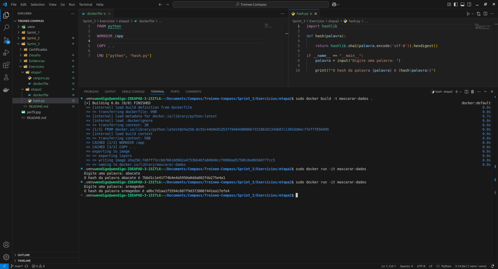

# Sprint 1

## Descrição da Sprint 1

O Docker é uma plataforma essencial para a criação e gerenciamento de containers, permitindo que aplicações e serviços sejam desenvolvidos, testados e executados de forma consistente em qualquer ambiente. Essa tecnologia é amplamente utilizada para otimizar processos de desenvolvimento, garantindo escalabilidade e eficiência. Como parte do trabalho de um engenheiro de dados, o uso de containers facilita a integração entre ferramentas e pipelines de dados, preparando o terreno para o aprofundamento em serviços da AWS, que serão explorados nas próximas etapas da trilha.

## Pastas

O repositório da Sprint 1 é dividida da seguinte forma:

- **Certificados:** essa pasta contêm as imagens dos certificados adquiridos durante a sprint que se apresentam também neste README
- **Desafio:** essa pasta contêm um README que explica o que é o desafio da sprint e as entregas exigidas para a conslusão dele como, por exemplo, um arquivo .SQL ou .py
- **Evidências:** essa pasta contêm prints que evidênciam a conclusão e os resultados dos exercícios realizados durante a sprint como também do próprio desafio. Neste caso, a pasta está dividida em mais duas: [Desafio](/Sprint_2/Evidencias/Desafio/) que apresenta as evidências do desafio e [Exercicios](/Sprint_2/Evidencias/Exercicios/) que apresenta as evidências dos exercícios.
- **Exercícios:** essa pasta contêm os arquivos que devem ser entregues para a conslusão dos exercícios realizados durante a sprint. Neste caso, o único exercício existente é divido em [Etapa 1](./Exercicios/etapa1/) e [Etapa 2](./Exercicios/etapa2/).

## Atividades e Cursos

Durante a sprint, os conceitos abordados a prendidos por meio de cursos, víedos e atividades foi:

- Uma visão completa sobre docker incluindo, por exemplo, a orquestração de containers com Kubernets e Docker Swarm para a mesma funcinalidade

- Um primeiro contato com os conceitos e funcionalidades do AWS pelo AWS Skill Builder

## Certificados

- [Docker para Desenvolvedores (com Docker Swarm e Kubernetes)](./Certificados/UC-1b727686-2943-4352-bbaa-9f88ed24fa0c.jpg)

## Exercícios

Etapa 1

- [**Script python:**](./Exercicios/etapa1/carguru.py)
- [**Dockerfile:**](./Exercicios/etapa1/dockerfile)

Etapa 2

- [**Script python:**](./Exercicios/etapa2/hash.py)
- [**Dockerfile:**](./Exercicios/etapa2/dockerfile)

## Evidências

- **Etapa 1:**

- **Etapa 2:**

