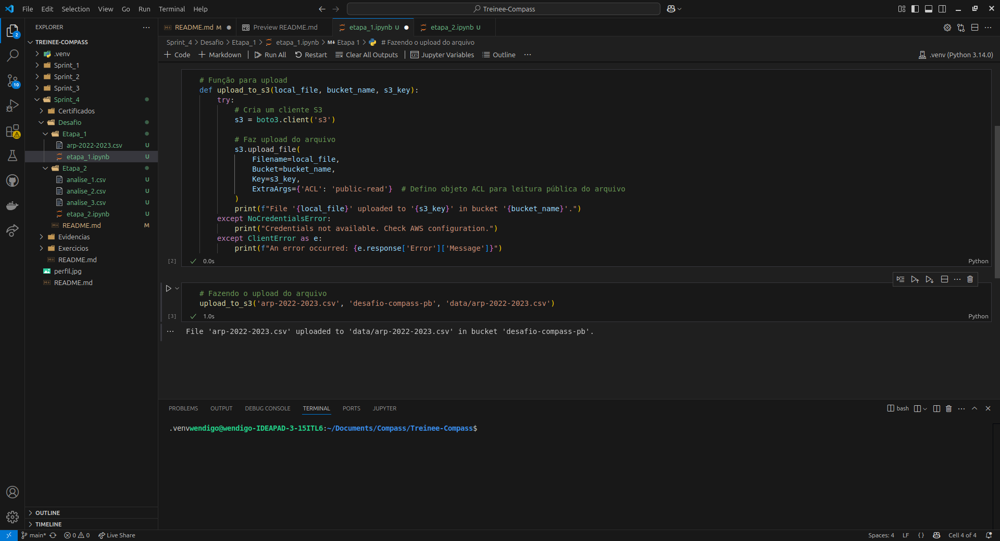
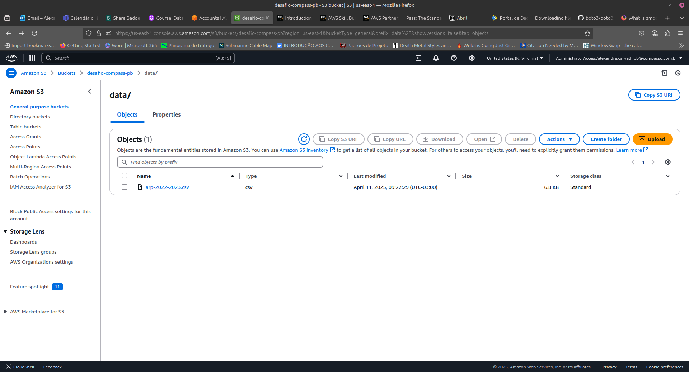
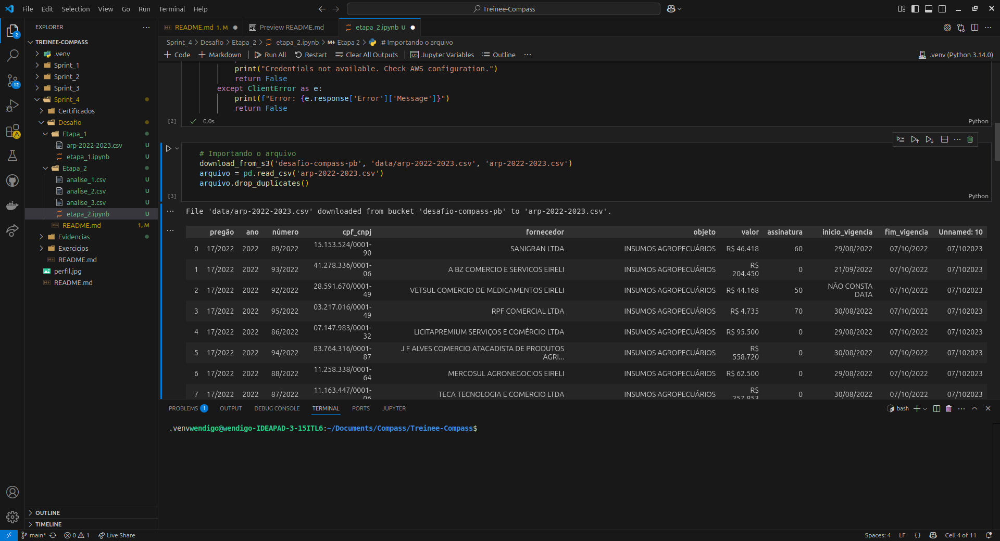
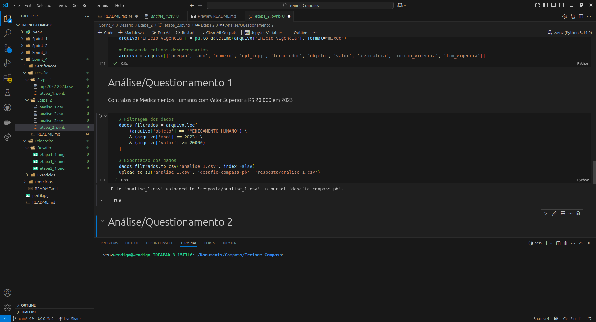
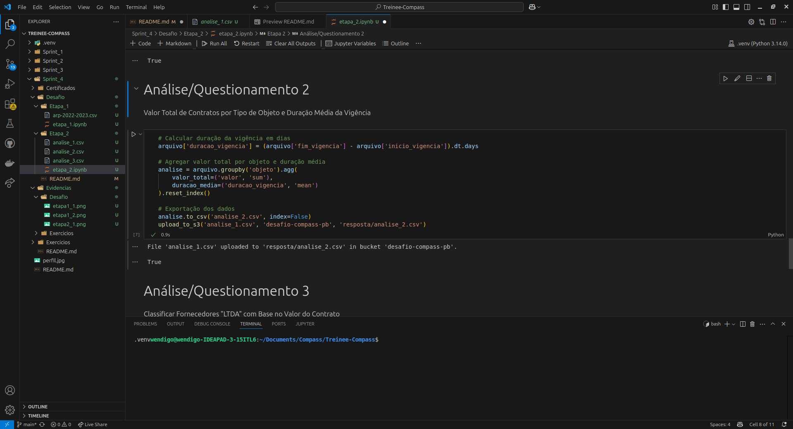
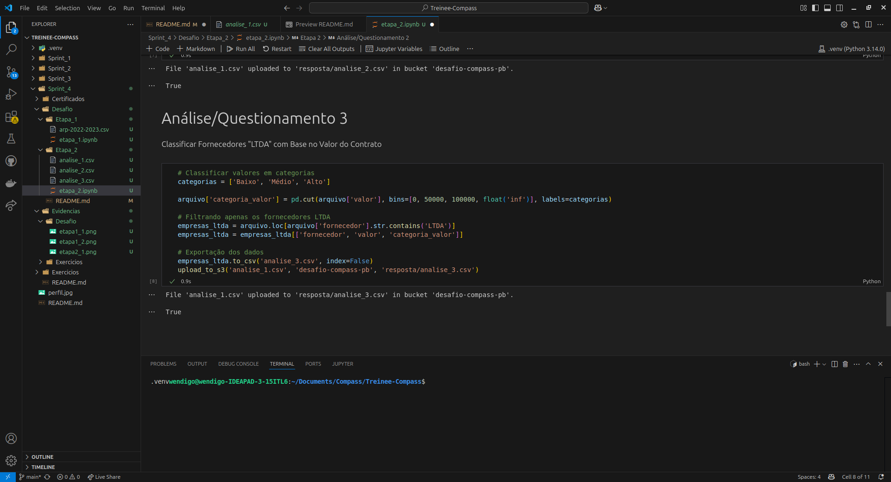

# Desafio da Sprint 1

## Enunciado

O objetivo é a prática utilizando serviços AWS.
Para a realização do desafio será necessário:

- Baixar um arquivo JSON ou CSV do portal de dados públicos do Governo Brasileiro
- Fazer o upload em um bucket S3 do arquivo baixado
- Criar dois arquivos IPYNB contenco o código usado para a execução de cada etapa corresponde do problema

**Etapa 1:** Analise o conjunto de dados escolhido localmente em editor de texto de sua preferência para conhecer os dados e o que pode ser análisado. Defina 3 questionamentos ou análises que pretende trazer com os dados escolhidos. A partir de um script Python, carregue o arquivo em um bucket novo utilizando a biblioteca **boto3**.

**Etapa 2:** Crue um dataframe com pandas ou polars e execute as análises escolhidas baseadas nas seguintes manipulações:

- Uma cláusula que filtra dados usando ao menos dois operadores lógicos;
- Uma função de agregação;
- Uma função condicional;
- Uma função de conversão;
- Uma função de data;
- Uma função de string.

**Etapa 3:** Após finalizar a análise e realizar as manipulações solicitadas, salve os arquivos resultantes no mesmo bucket criado para o desafio e no formato de entrada deles.

## Códigos Fonte

- [Etapa 1](./Etapa_1/etapa_1.ipynb)
- [Etapa 2](./Etapa_2/etapa_2.ipynb)

## Etapa 1

O arquivo CSV baixado se trata sobre as atas de registro de preço celebradas pela Universidade Federal do Pará. A partir dos seus dados as seguintes análises foram levantados:

- Contratos de Medicamentos Humanos com Valor Superior a R$ 20.000 em 2023
- Valor Total de Contratos por Tipo de Objeto e Duração Média da Vigência
- Classificar Fornecedores "LTDA" em Alto, Médio ou Baixo com Base no Valor do Contrato

Porém, antes de começar a análise, é necessário fazer o upload do [arquivo CSV](./Etapa_1/arp-2022-2023.csv) no bucket intituldo 'desafio-compass-pb'. O bucket foi configurado para não bloquear acessos públicos e permitir ações ACL - Access Control List para que contas AWS consigam realizar a inserção de arquivos dentro do bucket S3 criado.

Após, bastou escrever o script Python em um arquivo IPYNB que realiza o upload do arquivo a partir de uma função dentro do script:

```python
def upload_to_s3(local_file, bucket_name, s3_key):
    try:
        # Cria um cliente S3
        s3 = boto3.client('s3')
        
        # Faz upload do arquivo
        s3.upload_file(
            Filename=local_file,
            Bucket=bucket_name,
            Key=s3_key,
            ExtraArgs={'ACL': 'public-read'}  # Defino objeto ACL para leitura pública do arquivo
        )
        print(f"File '{local_file}' uploaded to '{s3_key}' in bucket '{bucket_name}'.")
    except NoCredentialsError:
        print("Credentials not available. Check AWS configuration.")
    except ClientError as e:
        print(f"An error occurred: {e.response['Error']['Message']}")
```

Na função, eu utilizao a função **upload_file** da biblioteca **boto3** a qual é necessário passar o nome do arquivo que se deseja fazer o upload, o nome do bucket, a chave S3 (que se refere a onde dentro do bucket o arquivo deve ser inserido + nome do arquivo) e, opcionalmente, defino um objeto ACl para leitura pública do arquivo dentro do bucket. Por fim, caso o upload apresente algum erro, ele retorna a mensagem de erro ou apresenta uma mensagem dizendo que ação foi realizada com sucesso.

No do primeiro script, eu chamo a função criada passando os parâmetros necessários:

```python
# Fazendo o upload do arquivo
upload_to_s3('arp-2022-2023.csv', 'desafio-compass-pb', 'data/arp-2022-2023.csv')
```

### Evidências da Etapa 1

- **Função retornando que a inserção do arquivo deu certo**


- **Arquivo presente no bucket**


## Etapa 2

Para puxar o arquivo CSV do bucket S3, eu uso uma função com uma estrutura parecida com a utilizada no script da etapa 1, mas dessa vez fazendo o download do arquivo:

```python
# Função de upload
def download_from_s3(bucket_name, s3_key, local_file_path):
    try:
        # Cria um cliente S3
        s3 = boto3.client('s3')
        
        # Faz o download do arquivo
        s3.download_file(
            Bucket=bucket_name,
            Key=s3_key,
            Filename=local_file_path
        )
        print(f"File '{s3_key}' downloaded from bucket '{bucket_name}' to '{local_file_path}'.")
        return True
    except NoCredentialsError:
        print("Credentials not available. Check AWS configuration.")
        return False
    except ClientError as e:
        print(f"Error: {e.response['Error']['Message']}")
        return False
```

Na função, eu utilizao a função **download_file** da biblioteca **boto3** a qual é necessário passar o nome do arquivo que se download fazer o upload, o nome do bucket, a chave S3 (que se refere a onde dentro do bucket o arquivo deve ser procurado + nome do arquivo). Por fim, caso o download apresente algum erro, ele retorna a mensagem de erro ou apresenta uma mensagem dizendo que ação foi realizada com sucesso.

A partir do arquivo baixado, eu faço sua leitura utilizando o **pandas** e faço a eliminação de duplicatas.

```python
# Importando o arquivo
download_from_s3('desafio-compass-pb', 'data/arp-2022-2023.csv', 'arp-2022-2023.csv')
arquivo = pd.read_csv('arp-2022-2023.csv')
arquivo.drop_duplicates()
```

Com o arquivo baixado e lido dentro do script, eu faço o tratamento dos dados que se refere a:

- Transformar os dados númericos de string para float
- Substituir os valores com frases como "não informado" e "NÃO CONSTA DATA" com valore vazios
- Transfirmar os valores de data de string para datatime
- Retirar colunas repetidas

```python
# Tratamento dos dados

# Tratando valores numéricos
arquivo['valor'] = arquivo['valor'].apply(lambda x: x.replace('R$ ', ''))
arquivo['valor'] = arquivo['valor'].apply(lambda x: x.replace('.', ''))
arquivo['valor'] = arquivo['valor'].astype(float)

# Tratando as datas
arquivo['fim_vigencia'] = arquivo['fim_vigencia'].apply(lambda x: x if x != 'não informado' else '')
arquivo['fim_vigencia'] = pd.to_datetime(arquivo['fim_vigencia'], format="mixed")
arquivo['fim_vigencia'] = arquivo['fim_vigencia'] + pd.DateOffset(years=1)

arquivo['inicio_vigencia'] = arquivo['inicio_vigencia'].apply(lambda x: x if x != 'NÃO CONSTA DATA' else None)
arquivo['inicio_vigencia'] = pd.to_datetime(arquivo['inicio_vigencia'], format="mixed")

# Removendo colunas desnecessárias
arquivo = arquivo[['pregão', 'ano', 'número', 'cpf_cnpj', 'fornecedor', 'objeto', 'valor', 'assinatura', 'inicio_vigencia', 'fim_vigencia']]
```

### Análise 1 - Contratos de Medicamentos Humanos com Valor Superior a R$ 20.000 em 2023

Nessa análise, eu realizo a filtragem dos dados utilizando mais de um operador lógico que, neste caso, é o de igualdade e o de maior ou igual:

```python
# Filtragem dos dados
dados_filtrados = arquivo.loc[
    (arquivo['objeto'] == 'MEDICAMENTO HUMANO') \
    & (arquivo['ano'] == 2023) \
    & (arquivo['valor'] >= 20000)
]
```

### Análise 2 - Valor Total de Contratos por Tipo de Objeto e Duração Média da Vigência

Nessa análise, eu realizo uma função de data, que seria a subtração da data de início e fim da vigência em dias, e uma função de agregação sobre o valor total e a duração da vigẽncia. Esse processo é demonstrado no código a seguir:

```python
# Calcular duração da vigência em dias
arquivo['duracao_vigencia'] = (arquivo['fim_vigencia'] - arquivo['inicio_vigencia']).dt.days

# Agregar valor total por objeto e duração média
analise = arquivo.groupby('objeto').agg(
    valor_total=('valor', 'sum'),
    duracao_media=('duracao_vigencia', 'mean')
).reset_index()
```

### Análise 3 - Classificar Fornecedores "LTDA" com Base no Valor do Contrato

Nessa análise, eu faço uma função de string para verificar quais são os fornecedores que possuem em seu nome "LTDA" e uma função de condição para classificar o valor de cada contrato em Alto, Médio e Baixo.

A função de condição é é realizada utilizando a função **cut** que cria intervalor de valores o que permite classificar esses intervalos.

```python
# Classificar valores em categorias
categorias = ['Baixo', 'Médio', 'Alto']

arquivo['categoria_valor'] = pd.cut(arquivo['valor'], bins=[0, 50000, 100000, float('inf')], labels=categorias)

# Filtrando apenas os fornecedores LTDA
empresas_ltda = arquivo.loc[arquivo['fornecedor'].str.contains('LTDA')]
empresas_ltda = empresas_ltda[['fornecedor', 'valor', 'categoria_valor']]
```

### Evidências da Etapa 2

- **Função retornando que o download do arquivo deu certo**


- **Arquivos gerados pelas análises**

1. [Análise 1](./Etapa_2/analise_1.csv)
2. [Análise 1](./Etapa_2/analise_2.csv)
3. [Análise 1](./Etapa_2/analise_3.csv)

## Etapa 3

No próprio script da segunda etapa do desafio já é realizado o upload dos arquivos gerados para o bucket S3

```python
# Exportação dos dados
dados_filtrados.to_csv('analise_1.csv', index=False)
upload_to_s3('analise_1.csv', 'desafio-compass-pb', 'resposta/analise_1.csv')

# ...

# Exportação dos dados
analise.to_csv('analise_2.csv', index=False)
upload_to_s3('analise_1.csv', 'desafio-compass-pb', 'resposta/analise_2.csv')

# ...

# Exportação dos dados
empresas_ltda.to_csv('analise_3.csv', index=False)
upload_to_s3('analise_1.csv', 'desafio-compass-pb', 'resposta/analise_3.csv')
```

Feito as ações necessárias para realizar as análises, eu exporto os dados para o mesmo o diretório do script para então fazer o upload deles utilizando a mesma função que foi usada na primeira etapa do desafio, porém, dessa vez passando uma outra chave que será utilizada especificamente para armazenar os arquivos gerados na segunda etapa do desafio.

### Evidências da Etapa 3

- **Exportação e upload do arquivo da análise 1**


- **Exportação e upload do arquivo da análise 2**


- **Exportação e upload do arquivo da análise 3**

