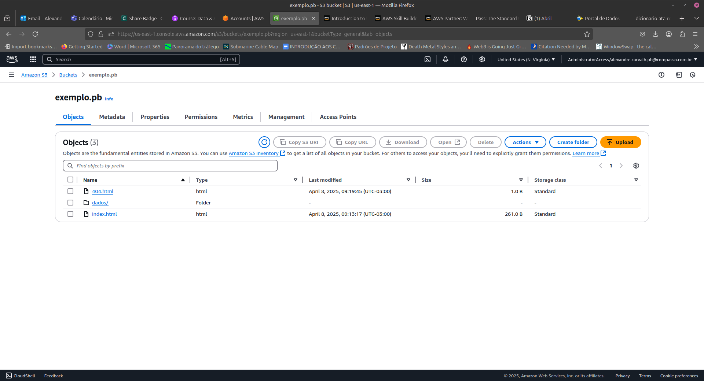

# Sprint 4

## Descrição da Sprint 4

Dando continuidade à série de cursos focados na plataforma, a Amazon Web Services (AWS) é líder em serviços de computação em nuvem, oferecendo uma ampla gama de soluções para processamento, armazenamento e análise de dados. Para engenheiros de dados, o domínio dessas ferramentas é essencial, pois permite o desenvolvimento de pipelines escaláveis, armazenamento eficiente e processamento de grandes volumes de dados. Além disso, a certificação AWS é amplamente reconhecida no mercado e demonstra proficiência técnica, aumentando as oportunidades de carreira e destacando o profissional em um mercado competitivo.

## Pastas

O repositório da Sprint 1 é dividida da seguinte forma:

- **Certificados:** essa pasta contêm as imagens dos certificados adquiridos durante a sprint que se apresentam também neste README
- **Desafio:** essa pasta contêm um README que explica o que é o desafio da sprint e as entregas exigidas para a conslusão dele como, por exemplo, um arquivo .SQL ou .py
- **Evidências:** essa pasta contêm prints que evidênciam a conclusão e os resultados dos exercícios realizados durante a sprint como também do próprio desafio. Neste caso, a pasta está dividida em mais duas: [Desafio](/Sprint_2/Evidencias/Desafio/) que apresenta as evidências do desafio e [Exercicios](/Sprint_2/Evidencias/Exercicios/) que apresenta as evidências dos exercícios.
- **Exercícios:** essa pasta contêm os arquivos que devem ser entregues para a conslusão dos exercícios realizados durante a sprint. Neste caso, o único exercício existente é divido em [Etapa 1](./Exercicios/etapa1/) e [Etapa 2](./Exercicios/etapa2/).

## Atividades e Cursos

## Certificados

- [AWS Partner: Sales Accreditation (Business) (Português)](./Certificados/13660_3_7235508_1743576212_AWS%20Course%20Completion%20Certificate.pdf)
- [AWS Partner: Cloud Economics (Portuguese)](./Certificados/16197_3_7235508_1743599195_AWS%20Course%20Completion%20Certificate.pdf)
- [AWS Partner: Cloud Quest](./Certificados/aws-cloud-quest-cloud-practitioner.png)

## Exercícios

Lab AWS S3

- [Arquivo 404.html para erros](./Exercicios/Lab_S3/404.html)
- [Arquivo index](./Exercicios/Lab_S3/index.html)
- [Pasta dados com o arquivo nomes.csv](./Exercicios/Lab_S3/dados/)

Lab AWS Athena

- [Querie para criação da tabela](./Exercicios/Lab_athena/tabela.sql)
- [Queria para realização da consulta](./Exercicios/Lab_athena/consulta.sql)

Lab AWS Lambda

- [Arquivo dockerfile para criação da imagem com o pandas](./Exercicios/Lab_lambda/dockerfile)
- [Arquico zip gerado para ser adicionado no bucket S3](./Exercicios/Lab_lambda/minha-camada-pandas.zip)

Lab AWS - Limpeza de recursos

- [Script SQL para deletar a tabela e o schema criado](./Exercicios/Lab_limpeza/limpeza.sql)

## Evidências

- **Lab AWS S3:**

- **Lab AWS Athena:**

[Consulta que lista os 3 nomes mais usados em cada década desde o 1950 até hoje](./Evidencias/Exercicios/70a1cd13-b150-4e87-b2a0-3bef36b205b5.csv)

- **Lab AWS Lambda:**

- **Lab AWS - Limpeza de recursos**

